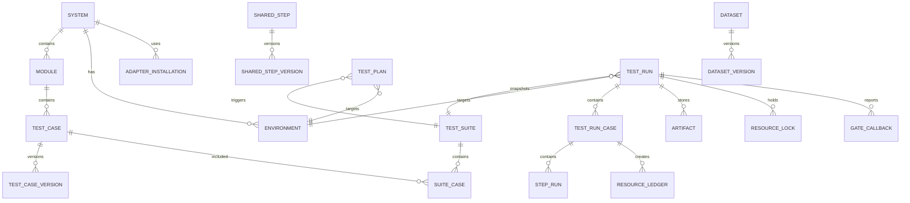

# 数据模型基线

## 1. 建模原则

- 可编辑对象与不可变版本分离；
- 运行创建后固定所有依赖版本；
- 当前状态与历史事实分离；
- 原始失败、重试和清理分别保存；
- 密钥只保存引用和加密值，不进入用例版本；
- 第一版为单组织，但实体保留未来增加 `organization_id` 的迁移空间。

## 2. 核心关系

## 3. 配置和资产实体

### 3.1 `systems`

被测系统。主要字段：`id`、`key`、`name`、`description`、`status`、并发上限、保留策略和时间戳。第一版的“项目级配额”以系统为边界。

### 3.2 `modules`

系统内的业务模块。字段：`id`、`system_id`、`key`、`name`、`sort_order`。

### 3.3 `environments`

独立被测环境。字段：

- `system_id`、`key`、`name`、`kind`（`test|staging|production`）；
- `base_url`、允许的协议/主机/端口/路径；
- 允许的最高动作等级；
- 环境并发上限、默认时区；
- 适配器配置，不含密钥；
- 健康检查定义及状态。

生产环境默认只允许 `read`。

### 3.4 `secrets`

字段：`id`、`system_id`、可选 `environment_id`、`key`、加密值、版本、最后轮换时间。API 只返回元数据，不返回明文。

### 3.5 `adapter_installations`

记录系统启用的适配器包、版本、协议版本、配置、能力摘要和兼容状态。实际包随 Worker 镜像交付。

### 3.6 `test_cases` 与 `test_case_versions`

`test_cases` 保存稳定身份、模块、名称、当前状态、当前草稿版本和当前发布版本。`test_case_versions` 保存不可变定义、Schema 版本、变更说明、内容哈希、创建时间和发布校验结果。

删除用例采用归档，不物理删除被历史运行引用的版本。

### 3.7 `shared_steps` / `shared_step_versions`

公共步骤与 Fixture 的不可变版本。用例发布时把引用固定到具体版本，禁止运行时解析“最新版本”。

### 3.8 `datasets` / `dataset_versions`

表格或 JSON 数据集。每行生成独立测试迭代。敏感列只能保存 `secret_ref`，不得直接保存密钥。

### 3.9 `test_suites` 与 `suite_cases`

套件维护用例成员、过滤标签、默认重试和默认并发。运行创建时固定用例发布版本、公共步骤版本和数据集版本。

### 3.10 `test_plans`

定时计划。保存套件、环境、IANA 时区、Cron 表达式、下一次触发时间、运行参数、启停状态和幂等游标。

## 4. 运行事实实体

### 4.1 `test_runs`

主要字段：

- `id`（即 `run_id`）、触发类型、触发来源、幂等键、优先级；
- 系统、环境、套件及其不可变快照；
- 平台版本、Worker 镜像、执行器和适配器版本；
- 被测系统版本；
- `queued_at`、`started_at`、`finished_at`；
- 运行状态、门禁结论、汇总计数；
- 取消请求和中断原因；
- 原始失败及清理汇总。

唯一约束：同一触发方、系统和幂等键只能创建一个运行。

### 4.2 `test_run_cases`

一条记录代表“用例版本 + 数据集行 + 真实模型重复序号”的一次迭代。保存尝试次数、最终分类、首次失败、是否 `flaky`、清理状态和耗时。

### 4.3 `step_runs`

保存步骤路径、动作类型、开始/结束、输入摘要、输出摘要、错误、结果分类和附件引用。循环步骤使用层级路径而不是复制定义。

### 4.4 `artifacts`

保存 MinIO 对象键、类型、大小、哈希、保留期限、脱敏状态和锁定状态。类型包括日志、截图、视频、Trace、HTTP 交换、工具调用、命中文档、Judge 结果和外部报告。

### 4.5 `resource_ledger`

记录运行创建或认领的外部资源：资源类型、系统标识、创建步骤、清理动作、清理状态和最后错误。危险删除前必须匹配本表或环境登记的测试资源。

### 4.6 `resource_locks`

字段：锁键、运行/用例迭代、租约截止时间、心跳时间和释放原因。锁键由系统适配器规范化。

### 4.7 `gate_callbacks`

保存回调目标引用、签名方式、尝试次数、最后响应和投递状态。回调负载固定包含运行 ID、被测版本、门禁结果、失败摘要和报告地址。

## 5. 运维实体

### 5.1 `workers`

记录 Worker 实例、镜像摘要、能力、并发槽、最近心跳和状态。第一版 `identity` 可为空，但字段保留。

### 5.2 `operation_audits`

记录时间、来源 IP、请求 ID、入口、`actor=anonymous`、对象、动作、修改前后版本和结果。密钥值不能进入审计内容。

### 5.3 `cleanup_jobs`

Worker 中断或常规清理失败后的补偿任务。它独立于原测试运行，保存资源清单、人工重试次数和最终处理结果。

## 6. 状态枚举

### 6.1 运行过程

`queued | preparing | running | cancelling | cleaning | interrupted | compensation_pending | completed`

### 6.2 用例结果

`passed | product_failed | test_failed | environment_failed | infrastructure_failed | flaky | cancelled | skipped`

### 6.3 清理状态

`not_required | pending | running | succeeded | failed | compensation_pending`

### 6.4 门禁结果

`passed | blocked | inconclusive`

环境或基础设施不可用默认产生 `inconclusive`，不能伪装为产品通过或失败。是否阻断发布由项目门禁策略决定。

## 7. 一致性规则

1. 已发布版本不可修改，只能创建新版本。
2. 运行不得引用“最新”版本，必须保存具体版本 ID 和内容哈希。
3. 运行终态前必须产生清理状态；没有副作用时为 `not_required`。
4. 首次失败步骤不可被重试覆盖。
5. 附件删除只清理对象，不删除运行摘要和哈希。
6. 归档系统、环境或用例前必须停止计划，历史运行仍可读取。
7. 审计数据和密钥数据分库不是 MVP 要求，但应用权限必须分离。
