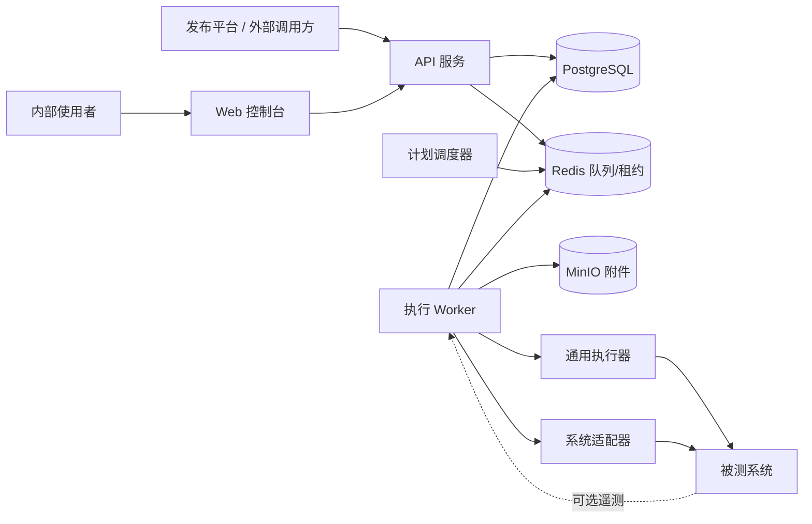
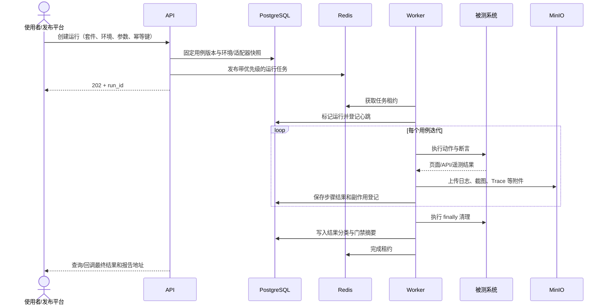

# 系统架构基线

## 1. 架构目标

- 控制面与执行面分离；
- 平台核心与业务适配器分离；
- 用例定义与具体执行器版本分离；
- 运行状态、证据和副作用可恢复、可审计；
- 首版可在单台测试机运行，后续可增加内网 Worker 水平扩展。

## 2. 逻辑组件



### 2.1 Web 控制台

提供系统与环境、用例、公共步骤、套件、运行、计划和平台配置页面。只消费公开 API，不直接访问数据库、Redis 或 MinIO。

### 2.2 API 服务

负责输入校验、用例版本、发布静态检查、运行快照、查询、附件签名 URL、审计和发布门禁回调。API 不直接运行测试。

### 2.3 计划调度器

根据带时区的计划生成测试运行。使用数据库唯一约束和幂等键避免多实例重复触发。调度器不持有执行状态。

### 2.4 Worker

主动从 Redis 拉取任务，获取带过期时间的租约并持续心跳。Worker 创建隔离执行容器，注入已解析但不落盘的密钥，采集结构化结果和附件，最后执行清理阶段。

第一版 Worker 不认证，只允许部署在受控内网，Redis 和 Worker 控制接口不得暴露到公网。协议预留 `worker_identity` 与认证能力。

### 2.5 通用执行器

- Playwright Chromium 浏览器；
- HTTP/Webhook；
- MCP 客户端；
- 等待与轮询；
- JSON 提取、变量赋值；
- 只读数据库查询；
- Fixture、公共步骤与清理执行；
- 外部项目测试命令的受控注册入口。

通用执行器不理解知识库、Skill、订单等业务概念。

### 2.6 系统适配器

适配器以受信任的、版本化 npm 包随 Worker 镜像发布，声明环境配置 Schema、动作、断言、Fixture、遥测能力和兼容范围。不能在运行中动态下载或安装。

## 3. 单次运行链路



## 4. 状态与恢复

运行状态：

```text
queued -> preparing -> running -> cleaning -> completed
   |          |           |          |
   +----------+-----------+----------+-> cancelling -> cleaning -> completed
                         worker lost -> interrupted -> compensation_pending
```

- Worker 心跳和任务租约都具有过期时间；
- Worker 失联后不自动重跑已产生写操作的用例；
- 副作用登记形成独立清理补偿任务；
- 用户可从头重跑，但不能从任意步骤恢复，避免重复副作用；
- API 和触发入口接受幂等键，重复请求返回原运行；
- 资源锁带租约，Worker 失联后由协调器安全释放。

## 5. 隔离与并发

- 每次运行生成全局唯一 `run_id`；
- 每个用例迭代在独立容器/浏览器上下文中执行；
- 可声明环境锁、账号锁、知识库锁等资源锁；
- 用例之间禁止直接依赖，共享准备逻辑通过 Fixture 实现；
- 系统和环境具有并发上限；
- 至少保留一个 Worker 槽位给高优先级任务；
- 首版正式浏览器仅为 Chromium 桌面端。

## 6. 网络与密钥安全

### 6.1 目标白名单

所有浏览器、HTTP、Webhook、MCP 和数据库连接都从登记环境解析目标，不接受用例直接提供任意主机。执行前及每次重定向后校验：

- 协议；
- 解析后的 IP；
- 主机和端口；
- 环境允许的路径前缀；
- 禁止的环回、链路本地和云元数据地址。

### 6.2 密钥

- 用例只保存 `secret_ref`；
- API 在创建运行时生成密钥引用快照，Worker 执行时按需解析；
- 原值不得写入数据库运行记录、Redis、日志、Trace 或导出文件；
- 所有输出经过集中脱敏器；
- 第一版使用服务端主密钥加密保存，生产化前可替换为外部密钥管理系统。

### 6.3 危险动作

动作能力分为 `read`、`write`、`dangerous`。环境声明最高允许等级。危险动作只能操作运行副作用登记中由本次运行创建的资源，或显式登记的测试资源。

## 7. 可观测性

每次运行至少记录：

- `run_id`、触发来源、幂等键；
- 平台版本、Worker 镜像摘要、执行器与适配器版本；
- 被测系统版本或 Commit；
- 环境配置摘要，不含密钥；
- 用例及公共步骤的不可变版本；
- 每一步开始、结束、重试、耗时和分类；
- 浏览器 Trace、截图、结构化请求响应；
- 可选的模型请求元数据、工具调用、规范化参数、工具结果、命中文档和最终回答；
- 原始失败、诊断重试和清理结果。

## 8. 物理部署

第一版使用 Docker Compose 部署到星火 Agent 测试机 `192.168.110.136`：

```text
web
api
scheduler
worker-controller
worker-executor (按并发启动)
postgres
redis
minio
```

测试机当前为 40 核、32 GB。平台容器必须设置 CPU、内存和并发上限，与被测系统隔离。初始容量目标为 50 个以内使用者、5,000 个用例和最多 20 个任务并发；真实浏览器并发需通过压测确定，不能直接按任务容量配置为 20。

## 9. 备份与保留

- PostgreSQL 中的用例、版本、套件、环境、计划和运行摘要每日备份；
- 成功运行详细附件默认保留 30 天；
- 失败运行详细附件默认保留 180 天；
- 重要运行可以锁定，跳过自动过期；
- 摘要和趋势长期保留；
- 定期执行恢复演练并记录恢复时间及校验结果。

## 10. 后续扩展边界

- 跨网络 Worker 前启用 Worker 身份认证；
- 用户体系通过 OIDC 接入，不改变运行事实模型；
- 单机 Compose 可迁移至 Kubernetes，但不是 MVP 前置条件；
- Allure Report 可作为首版人类可读报告，集中智能归因需求增长后再评估 ReportPortal 或其他产品；
- 阿里云 `120.55.94.4` 作为独立环境接入，不继承测试环境证据和账号。
